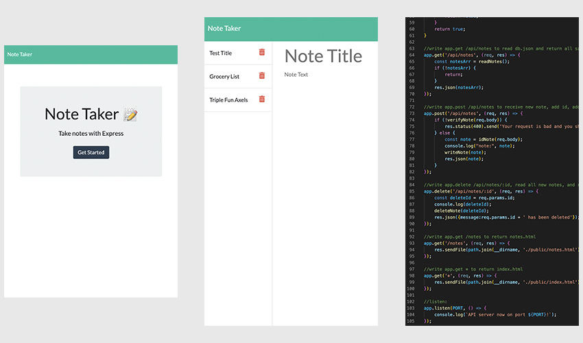

# intenseJourney 1.0
  

  

  ## OVERVIEW:
   A simple note taking app.. This app facilitates recording any manner of thoughts or todo lists, with miminal connectivity.. This app keeps files on a local JSON file, eliminating the fear of interception online.. Even simple apps like this allow for complex interactions between the front and backend of a web interface..

  ## Table Of Contents:
  [Installation](README.md#installation) 
  [Usage](README.md#usage) 
  [Tests](README.md#tests) 
  [Credits](README.md#credits) 
  [Questions](README.md#questions) 
  [License](README.md#license) 

  ## Installation
  The finished app runs entirely online, from server to website.

  ## Usage
  Make a note. If you no longer need it, delete it. This is not rocket science.

  ## Tests
  This was tested using insomnia, so thanks to those developers as well

  ## Credits
  This was built with js, Node, fs, path, express, and many other dependencies that i didn't even look at. It takes a village to make an app. Many thanks to all coders who contributed. 

  ## Questions
  [Becket, Codeclast](becketbowes@gmail.com)
  [Github Page](http://www.github.com/becketbowes)

  ## License
  [Creative Commons Attribution License, Sun Feb 27 2022 21:49:35 GMT-0500 (Eastern Standard Time)](https://creativecommons.org/licenses/by/4.0/legalcode)
